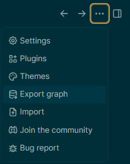
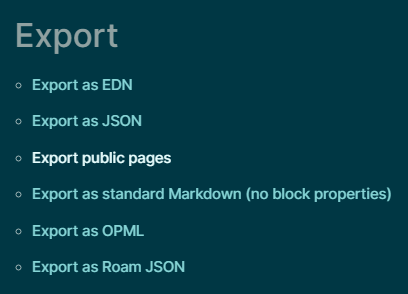

- #+BEGIN_WARNING
  Documentation is **not** part of the CI/CD pipeline currently and must be manually exported out of logseq
  #+END_WARNING
- Documentation is currently hosted using [github pages](https://pages.github.com/) as a static website generated by [logseq](https://logseq.com/)
- Logseq files are stored as plain markdown, so logseq isn't required to edit them, however logseq **is** required to build the documentation page.
- Logseq is available for Linux / MacOS / Windows from https://logseq.com/downloads
- # Building the github page
	- With Logseq open, access the `export graph` option under the ellipsis menu
		- 
	- Select `export public pages`
		- {:width 300}
	- Using the file browser dialog that appears, export the files to `droppii\doc\`
-